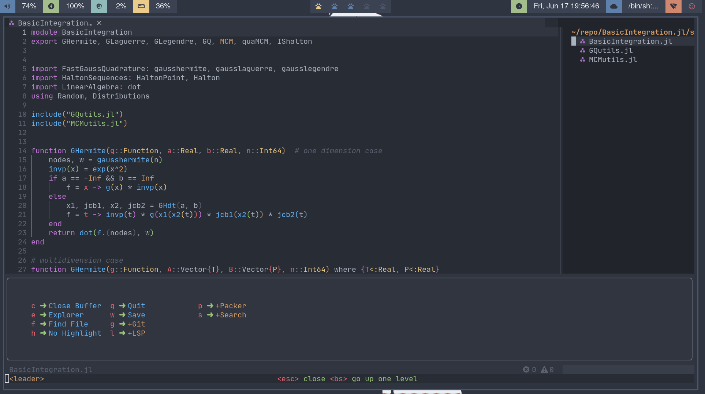

# nvimIDE
*this is my own neovim configuration*

## screenshot

## more information
### [reference](https://opottghjk00.github.io/content/NvimIDE/index.html)

## special thanks
*can't configure without this guy and his neovim progect - LunarVim*
- [Youtube - chris@machine](https://www.youtube.com/c/ChrisAtMachine)
    - [github](https://github.com/ChristianChiarulli)
- [LunarVim](https://github.com/LunarVim/LunarVim)
- [neovim from scratch](https://github.com/LunarVim/Neovim-from-scratch)
